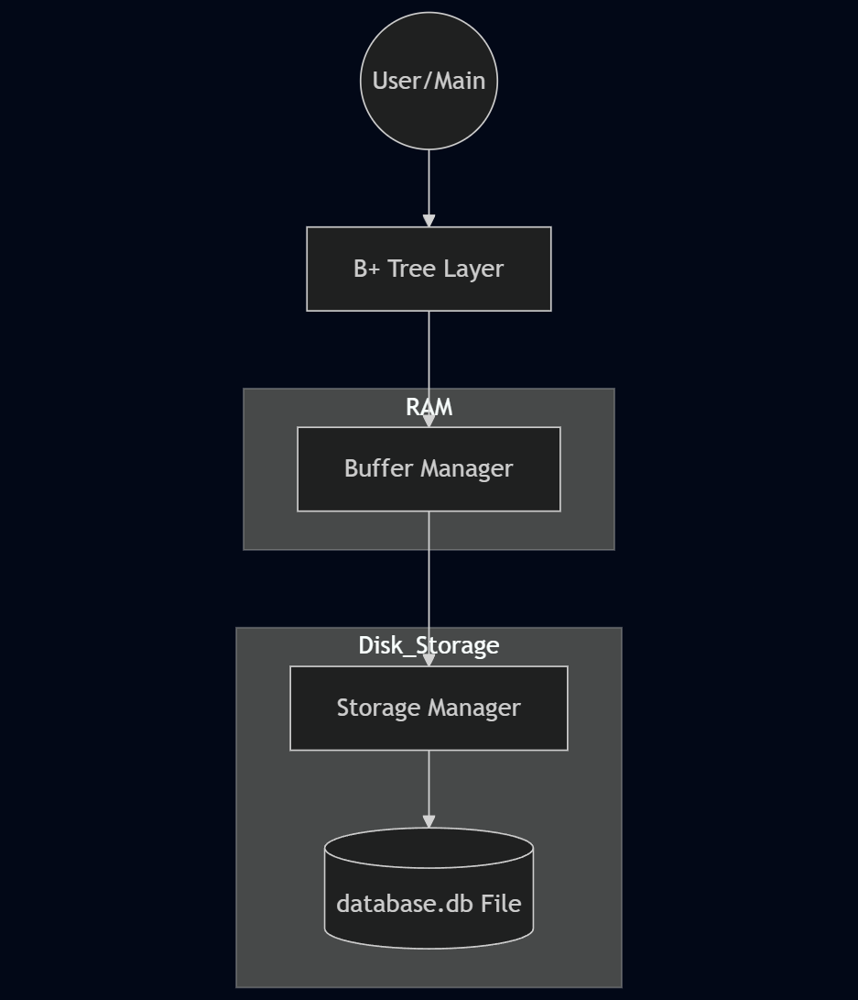
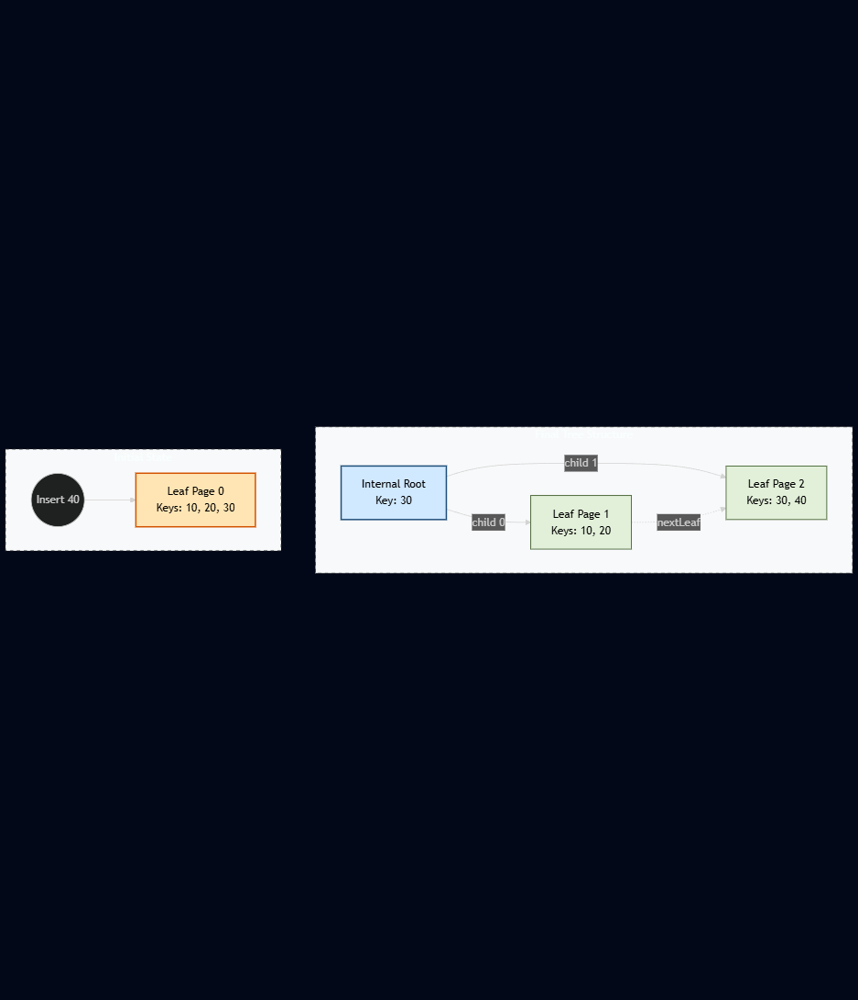

# 📑 Technical Specifications: Mini-DBMS Storage Engine

This document provides the technical details of the Mini-DBMS internal architecture, including physical storage layout, memory management, and indexing logic.

---

## 1. Architectural Overview
The system follows a layered architecture to achieve a separation of concerns between physical data on disk and logical data requested by the user.

- **Storage Layer (Disk):** Manages raw byte-offsets and persistence.
- **Buffer Layer (RAM):** Caches pages to reduce Disk I/O latency using an LRU policy.
- **Indexing Layer (B+ Tree):** Organizes data for $O(\log N)$ search complexity.

---

## 2. Physical Storage Design
The database treats the physical file (`database.db`) as a collection of fixed-size blocks.

- **Page Size:** 4096 Bytes (4 KB).
- **Alignment:** Pages are sector-aligned to match modern SSD/HDD physical blocks.
- **File Addressing:** Any page can be accessed randomly using the formula:
  `Offset = PageID * PAGE_SIZE`

---

## 3. Page Binary Layout
Each page in memory is mapped to the `BPlusNode` structure. The binary footprint is structured as follows:

| Offset (Bytes) | Field | Type | Description |
| :--- | :--- | :--- | :--- |
| 0 | `isLeaf` | bool | 1 if Leaf node, 0 if Internal |
| 1 | `numKeys` | int | Number of active keys in node |
| 5 | `parentPage` | int | PageID of the parent node |
| 9 | `keys[3]` | int[3] | Sorted array of integer keys |
| 21 | `children[4]` | int[4] | Child PageIDs (Internal) or Data (Leaf) |
| 37 | `nextLeaf` | int | Pointer to the next sibling leaf |

---

## 4. Buffer Management Policy
The **Buffer Manager** implements an **LRU (Least Recently Used)** replacement policy to maintain a 10-page cache in RAM.

### Replacement Logic:
1. **Page Table:** A hash map maps `PageID` to `FrameIndex` for $O(1)$ lookup.
2. **LRU List:** A doubly linked list tracks page age. The most recently accessed page moves to the **Front**.
3. **Eviction:** When the pool is full, the page at the **Tail** is evicted.
4. **Write-Back:** If the `dirty` flag is `true`, the page is written to disk *before* its frame is reused.

---

## 5. B+ Tree Indexing Logic
The B+ Tree serves as the primary indexing mechanism. 

### Split Procedure:
1. Find the target leaf.
2. If full (3 keys), create a new sibling page.
3. Move the upper half of the keys to the new sibling.
4. Promote the first key of the new sibling to the parent.
5. If parent is full, repeat the split recursively.

---

## 6. Development & Testing
- **Language:** C++11 or higher.
- **Persistence:** Binary file I/O using `fstream`.
- **Validation:** Consistency checks are logged in `tests/system_test_output.txt`.
